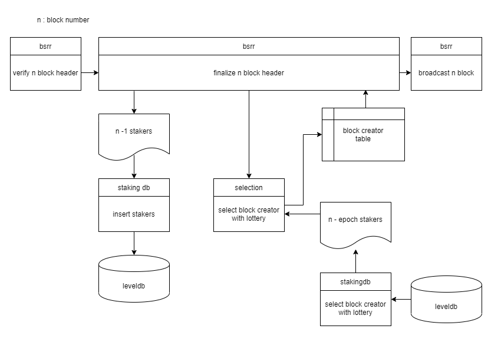

# Berith

Berith is a blockchain client written in go language.

## [Berith WhitePaper](./doc/BERITH_WhitePaper_190717_en.pdf)
The white paper shows what Berith is and what it is designed for.

## Berith architecture

The figure above shows the modules and tiers of Berith. Berith has a structure similar to Ethereum, but in certain parts, it has been modified.

### Consensus

Berith added three modules to implement the PoS consensus engine.

The figure above shows processes the added modules agree on the nth block. It shows what each module is doing in the process of the agreement. Below is a brief description of each module. Below is a brief description of each module.

#### BSRR
`BSRR` is the name of the Berith PoS consensus algorithm. It is a package that contains a structure that implements the Ethereum `Consensus` interface in the figure above. The `Consensus` interface has methods such as `VerifyHeader`, which validates the header of the block, `Finalize`, which validates the body of the block, and `Seal`, which passes to the p2p package the new block and the signal that propagates the block. Berith modified these methods for PoS.

#### Selection
`Selection` is a package that provides the ability to take a list of accounts and draw them to return their rank and priority.

#### StakingDB
`StakingDB` is a package that provides the function to store or query a list of accounts that have coins `staked` in the local DB.

More details can found in the agreement part below.

## [How to execute](./doc/runAndTest.md)
Introduces how to build Berith`s source code, run nodes, and test it.

## [Berith and Ethereum](./doc/etherAndBerith.md)
Berith is a [https://github.com/ethereum/go-ethereum](https://github.com/ethereum/go-ethereum) blockchain client that customized Ethereum. Introduce the differences between Berith and Ethereum.

## [Balance and Transaction](./doc/bal_tx.md)
Berith has a special balance and transaction model for implementing Stake and adding stability to paying block creation rewards.

## [Consensus algorithm](doc/consensus.md)

Berith is a blockchain client that implements the PoS consensus algorithm.
Introduces a detailed consensus method.

## [Berith hardfork](./doc/hardfork.md)

Introduces the hard fork history and how to proceed with the hard fork at Berith.

## [UI Wallet](./doc/uiwallet.md)

Berith contains UI Wallet written in Electron.
Introduces how Wallet works and how to execute it.

