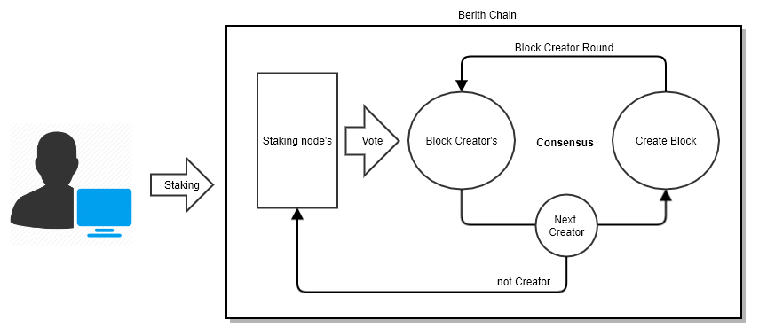
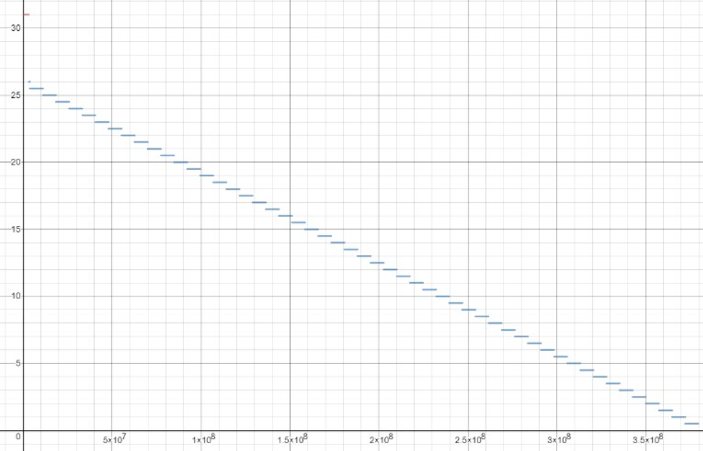

# Berith

## Introduction
- [알고리즘]

    * 베리드는 BC 를 선출 하여 블록에 대한 Reward 보상을 주는 PoS Chain 입니다.
    
    * 일정수량의 코인을 Stake 함으로 BC의 자격을 받을수 있습니다.
    
    * BC 는 매 라운드 마다 선출 하게 되며, 블록을 생성한 BC는 블록에 대한 Reward 를 받을수 있습니다.

    
- [지갑 구성]

    * 한개의 계정은 3개의 Balance 로 이루어져 있습니다.        
    * Reward Balance 는 Stake Balance 와 Main Balance 로 이동을 할수 있습니다.         
    * Stake Balance 는 Main Balance 로 이동 이 가능합니다.
    * Main Balance 는 Stake Balance 로 이동 또는 타 계정간의 거래 에 이용 되는 Balance 입니다.
    
        |**Balance Type**     |   설명                                                          |
        |:--------------------:|-----------------------------------------------------------------|
        | **`Main`**          | 계정간의 거래 에 대한 모든 행동을 처리 하게 되는 Balance 입니다.|    
        | **`Stake`**         | 현재 계정 의 Stake 한 수량을 보관 하는 Balance 입니다.          |
        | **`Reward`**        | Stake 에 대한 Reward 를 지급하기 위한 Balance 입니다.           |

- [리워드]
    * 블록 생성을 한자가 Reward 를 받게 됩니다. 
    * 해당 블록을 생성하자는 자가 생성 못하게 된다면 다른 BC 에게 권한이 넘어가게 됩니다.        
    
     
     
- [BC 선출]
    * 스테이킹 수량, 기간 등을 고려하여 확률적으로 선출 됩니다.
    * 선출은 매라운드 마다 진행됩니다.
 
      
## Building the source

1. Install Go SDK - https://golang.org/dl/
        
        go1.11.1 이상

2. Build

        ./build.sh  
    
    OR  
    
        go build ./cmd/berith
        
        
## Executables

| Command    | Description |
|:----------:|-------------|
| `berith` | 실제 노드를 구축 하며 여러가지 CLI 및 RPC 를 지원 합니다.  |

## CLI (추후 상세 정의)
Service berith

|  Command    | Description |
|:----------:|-------------|
| `stake` | 실제 노드를 구축 하며 여러가지 CLI 및 RPC 를 지원 합니다.  |
| `stopStaking` | 제네시스 파일을 만들어 줍니다. |
| `getAccountInfo` | 해당 계정의 모든 Balance 를 확인 할수 있습니다. |
| `getRewardBalance` | 해당 계정의 Reward Balance 를 확인 할수 있습니다. |
| `getStakeBalance` | 해당 계정의 Stake Balance 를 확인 할수 있습니다. |
| `getBalance` | 해당 계정의 Main Balance 를 확인 할수 있습니다. |
| `rewardToBalance` | 해당 계정에서 Reward Balance 를 Main Balance 로 이동 할수 있습니다. |
| `rewardToStake` | 해당 계정에서 Reward Balance 를 Stake Balance 로 이동 할수 있습니다. |
| `sendTransaction` | 해당 계정에서 Reward Balance 를 Stake Balance 로 이동 할수 있습니다. |

Service personal

|  Command    | Description |
|:----------:|-------------|
| `newAccount` | 새로운 계정을 만들게 됩니다.  |
| `lockAccount` | 해당 계정의 지갑을 lock 상태로 변경합니다.  |
| `unlockAccount` | 해당 계정의 지갑을 Unlock 상태로 변경합니다.  |

Service miner

|  Command    | Description |
|:----------:|-------------|
| `start` | 마이닝을 시작 합니다.  |
| `stop` | 마이닝을 정지 합니다.  |
| `setBerithbase` | 계정을 선택합니다.  |

Service amon

|  Command    | Description |
|:----------:|-------------|
| `getRoi` | 예상 수익률  |
| `getSigners` | 라운드 블록 사이너들을 확인 할수 있습니다.  |
| `getBlockCreator` | 현 라운드에 블록생성자로 선출된 리스트를 확인 할수 있습니다.  |
    
   
    
## Dev Tool

GoLand : https://www.jetbrains.com/go/

VsCode : https://code.visualstudio.com/

## License

GNU License v3.0
