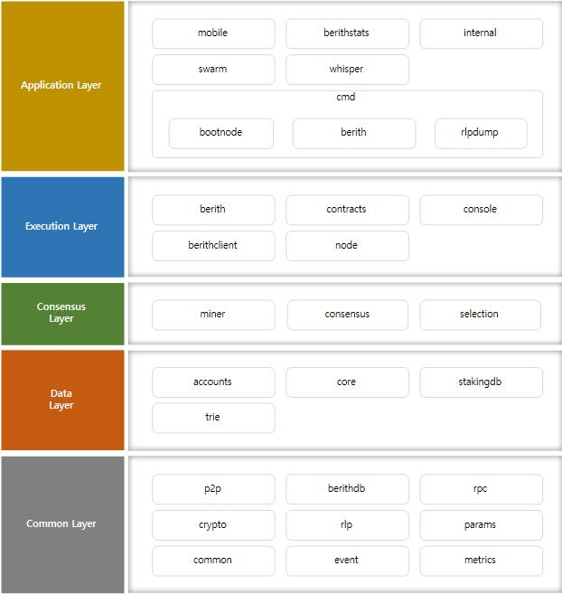
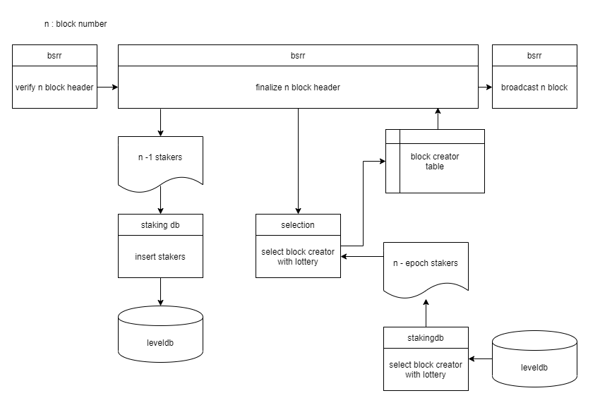

# Berith

베리드는 go 언어로 작성된 블록체인 클라이언트이다.

## [베리드 백서](./BERITH_WhitePaper_190717_en.pdf)
백서에서 베리드가 어떤 프로젝트이며, 무엇을 위해 기획되었는지 확인할 수 있다.

## 아키텍쳐

위의 그림은 베리드의 모듈과 계층에 대해서 나타내고 있다. 베리드는 구조적으로 이더리움과 유사하지만 특정 부분에서 구조를 변형하였다.

### Consensus

베리드는 PoS 합의 엔진을 구현하기 위해 세가지 모듈을 추가하였다.

위의 그림은 추가된 모듈들이 n 번째 블록을 합의하는 과정을 나타낸다. 그림에서 각 모듈이 합의 과정에서 어떤 일을 수행하는지 확인할 수 있다. 아래는 각 모듈에 대한 간략한 설명이다.

#### BSRR
`BSRR` 은 베리드 PoS 합의 알고리즘의 이름으로 위 그림의 이더리움의 `Consensus` 인터페이스를 구현하는 구조체를 포함하는 패키지이다. `Consensus` 인터페이스는 블록의 헤더를 검증하는 `VerifyHeader`, 블록의 바디를 검증하는 `Finalize`, 새로운 블록과 블록을 전파하는 신호를 p2p 패키지로 전달하는 `Seal` 등의 메소드를 가지고 있다. 베리드는 이 메소드들을 PoS 에 맞게 수정하였다.

#### Selection
`Selection` 은 계정의 목록을 받아서 이를 추첨하여 등수와 우선도를 반환하는 기능을 제공하는 패키지이다.

#### StakingDB
`StakingDB` 는 코인을 `Stake` 한 계정의 목록을 로컬 DB에 저장하거나 조회하는 기능을 제공하는 패키지이다.

자세한 내용은 아래의 합의 파트에서 확인할 수 있다.

## [실행 방법](./runAndTest_KOR.md)
베리드의 소스를 빌드하는 법, 노드를 실행하는 법, 테스트 하는 법에 대해 소개한다.

## [베리드와 이더리움](./etherAndBerith_KOR.md)
베리드는 [https://github.com/ethereum/go-ethereum](https://github.com/ethereum/go-ethereum) 를 커스터마이징한 블록체인 클라이언트이다. 베리드와 이더리움의 차이점에 대해 소개한다.

## [Balance와 State](./bal_tx_KOR.md)
베리드는 Stake 를 구현하고, 블록 생성 보상을 지급하는 것에 안정성을 더하기 위해 특별한 balance, transaction 모델을 가지고 있다.

## [합의 엔진](./consensus_KOR.md)

베리드는 PoS 합의 엔진을 구현한 블록체인 클라이언트로 자세한 합의 방법에 대해 소개한다.

## [베리드 하드포크](./hardfork_KOR.md)

베리드에서 진행되었던 하드포크 이력과 하드포크를 진행하는 방법에 대해 소개한다.

## [UI Wallet](./uiwallet_KOR.md)

베리드는 Electron으로 작성된 UI Wallet 을 포함하고 있다. 월렛의 작동원리와 실행방법에 대해 소개한다.

