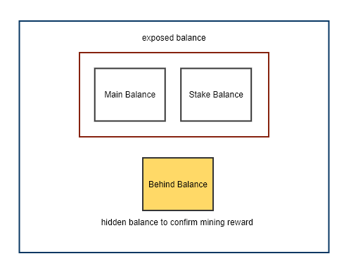
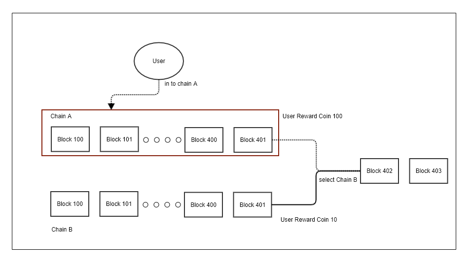
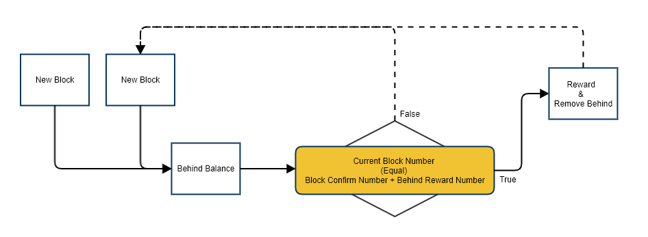

## Balance 와 State
베리드는 Stake 를 구현하고, 블록 생성 보상을 지급하는 것에 안정성을 더하기 위해 특별한 balance, transaction 모델을 가지고 있다.

### Balance
베리드에서 `Balance` 계정마다 할당된 코인의 잔액을 저장하는 메모리 공간으로 `State` 라는 저장소에 머클패트리샤트리의 형태로 저장된다.
#### Balance 의 종류
베리드에는 계정마다 세가지 종류의 `Balance` 를 가지고 있다. 



위의 그림은 세가지 종류의 `Balance` 의 구조를 나타내고 있다. 베리드가 제공하는 RPC 혹은 콘솔 명령어에서 노출되는 지갑인 `MainBalance`, `StakeBalance` 가 있으며 노드 내부에서 숨겨진 상태로 사용되는 `BehindBalance` 가 있다. 아래에는 각 `Balance` 에 대한 설명이다.

##### MainBalance
`MainBalance` 는 일반적인 코인의 잔액을 저장한다. `MainBalance` 의 코인은 다른 계정의 `MainBalance` 자신의 `StakeBalance` 로 언제든지 전송할 수 있다.
##### StakeBalance
`StakeBalance` 는 `Stake` 한 코인의 잔액을 저장한다. `StakeBalance` 의 코인은 본인의 `MainBalance` 로 전체 수량을 보내는 것만 가능하며, `StakeBalance` 의 수량에 따라 블록을 생성할 확률이 높아진다.
##### BehindBalance
`BehindBalance` 는 블록생성보상을 저장해 두었다가 `Epoch` 개의 블록 만큼 기다린 뒤, `MainBalance` 에 전달하는 임시 저장소이다. `BehindBalance` 의 내용은 RPC 나 콘솔 명령어를 통해 얻어낼 수 없다. 즉, 감줘져있는 `Balance` 이다.

베리드에서 블록생성보상지급을 지연시키는 것은 베리드가 체인의 포크를 허용하는 합의 방식을 가지고 있기 때문이다. 만약 두 체인이 포크되어 독립된 블록체인을 만든다고 한다면, 어느 한 쪽 체인이 다른 한쪽으로 병합 될 때 사라지는 쪽에 있었던 유저들은 리워드가 사라지는 현상을 겪게 될 것이다. 



위의 그림은 블록체인이 포크된 상황을 나타낸다. 만약 바로 블록생성보상이 지급되었다면, 그림속 유저는 본인이 속했던 체인이 없어지게 되면서 지급되었던 블록생성보상이 사라지는 경험을 하게 될 것이다. `BehindBalance` 는 이런 현상을 억제하기 위해 고안되었다.

위에서 `BehindBalance` 에 저장된 블록생성보상은 블록넘버와 보상의 구조체의 배열로 저장된다. 이후 새로운 블록을 받았을 때, 저장된 블록넘버와 받은 블록넘버를 비교하여 그 차이가 `Epoch` 이상인 경우 이를 `MainBalance` 로 이동한다.



위의 그림은 `BehindBalance` 에 저장된 블록생성보상이 `MainBalance`로 이동하는 과정을 나타내고 있다.

#### Balance 와 State
State 는 계정에 대한 정보를 나타내는 구조체이다. 이는 머클패트리샤트리의 형태로 로컬DB 에 저장된다. State 에는 `Balance` 에 대한 정보도 포함된다.

```
type Account struct {
	Nonce          uint64
	Balance        *big.Int
	Root           common.Hash // merkle root of the storage trie
	CodeHash       []byte
	StakeBalance   *big.Int //brt staking balance
	StakeUpdated   *big.Int //Block number when the stake balance was updated
	Point          *big.Int //selection Point
	BehindBalance  []Behind //behind balance
	Penalty        uint64
	PenlatyUpdated *big.Int //Block Number when the penalty was updated
}
```

위의 코드는 state 에 저장되는 정보중 계정을 나타내는 구조체의 선언부이다. 위에서 설명했던 `MainBalance` 를 나타내는 `Balance` 를 포함하여 `StakeBalance`, `BehindBalance` 가 선언된 것을 확인할 수 있다. 

##### EVM과 트랜잭션의 처리

트랜잭션은 EVM에 의해 처리되어 `State` 를 변경한다. 베리드는 EVM의 트랜잭션 처리를 수정하여 트랜잭션의 형태에 따라 알맞게 `State` 기 변경되도록 했다.

```
func Transfer(db vm.StateDB, sender, recipient common.Address, amount, blockNumber *big.Int, base, target types.JobWallet) {
	/*
		[BERITH]
		Tx 를 state에 적용
	*/
	switch base {
	case types.Main:
		if target == types.Main {
			db.SubBalance(sender, amount)
			db.AddBalance(recipient, amount)
		} else if target == types.Stake {
			//베이스 지갑 차감
			db.SubBalance(sender, amount)
			db.AddStakeBalance(recipient, amount, blockNumber)

		}

		break
	case types.Stake:
		if target == types.Main {
			//스테이크 풀시
			db.RemoveStakeBalance(sender)
		}
		break
	}
}
```
위의 코드는 EVM에서 트랜잭션을 처리하여 `State` 를 변경하는 함수의 내용이다. 트랜잭션의 형태에 따라 각기 다른 `Balance` 를 수정하는 것을 확인할 수 있다.

