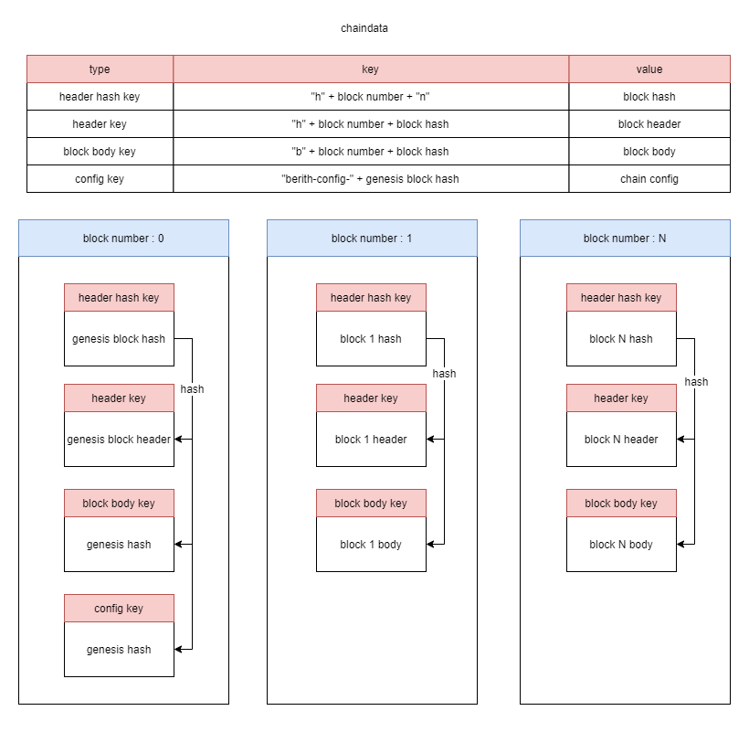
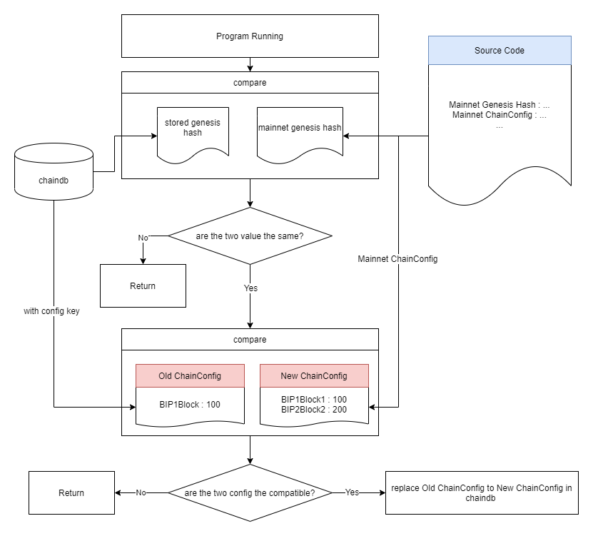

## Berith and Hardfork

### What is a hard fork?

Hard fork refers to a case in which blocks created in a patched version are not compatible with previous versions. If a user doesn't download the new version, later blocks cannot be registered on the blockchain.

#### Hard fork patches

To handle hard forks, the patched version must have both previous and modified algorithms. This is because the previous algorithm is used to verify the blocks accumulated so far, and the modified algorithm must be applied to the blocks after the hard fork point.

#### Berith hard fork

Berith uses `ChainConfig` for hard forks. You can create a hard fork by assigning a block number at the time of hard fork to `ChainConfig` and applying a new algorithm from that point on.
```
MainnetChainConfig = &ChainConfig{
        ChainID:             big.NewInt(106),
        HomesteadBlock:      big.NewInt(0),
        DAOForkBlock:        nil,
        DAOForkSupport:      true,
        EIP150Block:         big.NewInt(0),
        EIP155Block:         big.NewInt(0),
        EIP158Block:         big.NewInt(0),
        ByzantiumBlock:      big.NewInt(0),
        ConstantinopleBlock: big.NewInt(0),
        BIP1Block:           big.NewInt(508000),
        BIP2Block:           big.NewInt(545000),
        BIP3Block:           big.NewInt(1168000),

        ...

    }
```
The code above declares the default `ChainConfig` used when running Berith without a configuration file. `BIP1Block`, `BIP2Block`, and `BIP3Block` shown in the code all refer to the block numbers that were hard forked.

#### Chaindata compatible

You can apply a hard fork set to newly created `chaindata` by simply registering hardfork time in `ChainConfig`, but hard fork cannot be applied when executed with existing `chaindata`. You can apply hardfork setting to newly created `chaindata` by simply registering hard fork time in `ChainConfig`, but a hard fork cannot be applied when executed with existing `chaindata`. This is because the information on `ChainConfig` is saved when `genesisBlock` is created, and the previous `ChainConfig` is used when newly executing.



The above figure shows the schema of LevelDB that stores `chaindata`. You can see that the contents of `Chainconfig` are saved using the key using hash of Genesis block.

Berith has a default value that the `genesisHash` used by `chaindata` uses on the mainnet to solve this problem. And if the default `ChainConfig` registered in the code and `ChainConfig` stored in `chaindata` are not compatible with each other, it has the function to delete the `ChainConfig` stored in `chaindata` and change it to the default `ChainConfig`.



The above figure shows the process of replacing `ChainConfig` with` ChainConfig` registered in the code.

```
func (c *ChainConfig) checkCompatible(newcfg *ChainConfig, head *big.Int) *ConfigCompatError {
   
        ...

    if isForkIncompatible(c.BIP1Block, newcfg.BIP1Block, head) {
        return newCompatError("bip1 fork block", c.BIP1Block, newcfg.BIP1Block)
    }
    if isForkIncompatible(c.BIP2Block, newcfg.BIP2Block, head) {
        return newCompatError("bip2 fork block", c.BIP2Block, newcfg.BIP2Block)
    }
    if isForkIncompatible(c.BIP3Block, newcfg.BIP3Block, head) {
        return newCompatError("bip3 fork block", c.BIP3Block, newcfg.BIP3Block)
    }
    return nil
}
```
The code above is part of a function that checks if two `ChainConfigs` are compatible with each other. If you add a new hard fork point, you can overwrite the existing chain data `ChainConfig` with the newly registered `ChainConfig` by adding a condition that it is incompatible if there is no hard fork point added here.

### Berith hardfork history

#### BIP1

Fixed an issue where canceling a stake would not clear the account in `Stakers`.
```
if chain.Config().IsBIP1(number) {
            if msg.Base() == types.Main && msg.Target() == types.Stake {
                stkChanged[msg.From()] = true
            } else if msg.Base() == types.Stake && msg.Target() == types.Main {
                stkChanged[msg.From()] = false
            } else {
                continue
            }
        } else {
            if msg.Base() == types.Main && msg.Target() == types.Stake {
                stkChanged[msg.From()] = true
            } else {
                continue
            }
        }
```
The code above is where the transaction checks the type and creates the map. And iterate in the code, adding an account with a value of `true` to `Stakers`, and removing an account with a value of `false` from `Stakers`. From the block with BIP1 applied, you can see that other conditional statements are used in the transaction about stake release.

#### BIP2

Fixed an issue where the hash function was used incorrectly when creating a seed for the block creator draw.
```
func (cs Candidates) GetSeed(config *params.ChainConfig, number uint64) int64 {

    bt := []byte{byte(number)}
    if config.IsBIP2(big.NewInt(0).SetUint64(number)) {
        bt = big.NewInt(0).SetUint64(number).Bytes()
    }
    hash := sha256.New()
    hash.Write(bt)
    md := hash.Sum(nil)
    h := common.BytesToHash(md)
    seed := h.Big().Int64()

    return seed
}
```
The code above is the content of a function that gets the seed of a random `number` to generate for the drawing of the block constructor. Therefore, after BIP2, the entire `number` value is hashed so that the correct hash value can be obtained.

#### BIP3

Fixed an issue where the block creator draw result was inconsistent and a favorable account group was created.
```
func SelectBlockCreator(config *params.ChainConfig, number uint64, hash common.Hash, stks staking.Stakers, state *state.StateDB) VoteResults {
   
    ...

    if config.IsBIP3(big.NewInt(int64(number))) {
        result = cddts.selectBIP3BlockCreator(config, number)
    } else {
        result = cddts.selectBlockCreator(config, number)
    }

    return result

}
```
The code above is part of the block creator draw function. In the case of blocks after BIP3, you can see that a different function is called.

The two functions are executed with different algorithms. The following table summarizes them.

|Feature\Function|selectBlockCreator|selectBIP3BlockCreator|
|:---|:---|:---|
|Processing speed|fast|somewhat slow|
|Dispersion|inequality|equal|
|Processing method|The array is divided according to the binary search result of the entire array, and the draw result is obtained by binary searching the divided subarray again.|Binary search the entire array to get a draw result, and then repeat excluding the selected account through draw.

This was corrected because the processing speed could not be prioritized over the equality of the results.

