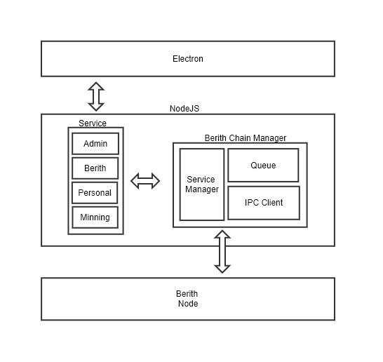

## Berith UI Wallet

Berith PC Wallet(or Wallet) is an Electron-based program designed to provide the functionality of Berith PoS nodes(or node) as a GUI. The wallet runs the node in the background, and the node processes the request from the Electron as an RPC and conveys the result back. The wallet returns the screen through the conveyed result.



The figure above shows the architecture of the Wallet.

### Communication between Wallet and Nodes

Wallet is a javascript program, and node is a golang program. Berith uses the following libraries for communication between the two: [https://github.com/asticode/go-astilectron](https://github.com/asticode/go-astilectron)

The library provides functions that both programs can communicate with.
```
async function sendMessage(methodType, methodName, args) {
    let messagePromise = new Promise(function (resolve) {
        let message = {"name": methodType};
        message.payload = {
            "api": methodName,
            "args": args
        }
        //asticode.loader.show()

        //console.log("Request: ", JSON.stringify(message));syncing
        astilectron.sendMessage(message, function (response) {
            //asticode.loader.hide();
            //console.log("Response: ", JSON.stringify(response));
            resolve(response);
        });
    });
    return messagePromise;
}
```
The code above shows the contents of a function written by the Wallet program to communicate with the node. You can see the use of the `astilection.sendMessage` function in the code.
```
func handleMessages(_ *astilectron.Window, m bootstrap.MessageIn) (payload interface{}, err error) {
    var info map[string]interface{}
    err = json.Unmarshal(m.Payload, &info)
    if err != nil {
        payload = nil
        return
    }
    api := info["api"]
    args := info["args"].([]interface{})
    switch m.Name {

    case "init":
        break
    case "polling":
        //ch2 <- true
        startPolling()
        break
    case  "stopPolling" :
        //ch2 <- false
        fmt.Print("logout!!!!")

        break
    case "callApi":
        payload, err = callNodeApi(api, args...)
        break
    case "callDB":
        payload , err = callDB(api , args...)
        break
    case "exportKeystore":
        args := info["args"].([]interface{})
        payload, err = exportKeystore(args)
        break

    case "importKeystore":
        args := info["args"].([]interface{})
        err = importKeystore(args)
        payload = nil
        break
    }

    if err != nil {
        astilog.Error(err.Error())
    }
    astilog.Debugf("Payload: %s", payload)
    return
}
```
The above code is the contents of the handler function of the node program to handle the request of the wallet program. 

### Wallet and Logs

Wallet stores log from nodes to determine the status of nodes running in the background. Logs are stored in two repositories. Berith uses the log package used by Ethereum. Register additional log handlers for additional log output from Wallet.
```
func Init() {

        ...

		app.Before = func(ctx *cli.Context) error {

		//TODO : wallet program shoud export log file without debug flag
		logdir := filepath.Join(node.DefaultDataDir(), "logs")

		batch = log.NewBerithLogBatch(logCh, logdir, time.Hour*24, log.TerminalFormat(false))

		go batch.Loop()

		if err := debug.SetupForWallet(ctx, logCh); err != nil {
			return err
		}
		
		...
		
}

func SetupForWallet(ctx *cli.Context, ch chan *log.Record) error {
	// logging
	log.PrintOrigins(ctx.GlobalBool(debugFlag.Name))

	glogger.SetHandler(log.MultiHandler(ostream, log.ChannelHandler(ch)))
	glogger.Verbosity(log.Lvl(ctx.GlobalInt(verbosityFlag.Name)))
	glogger.Vmodule(ctx.GlobalString(vmoduleFlag.Name))
	glogger.BacktraceAt(ctx.GlobalString(backtraceAtFlag.Name))
	log.Root().SetHandler(glogger)

	// profiling, tracing
	runtime.MemProfileRate = ctx.GlobalInt(memprofilerateFlag.Name)
	Handler.SetBlockProfileRate(ctx.GlobalInt(blockprofilerateFlag.Name))
	if traceFile := ctx.GlobalString(traceFlag.Name); traceFile != "" {
		if err := Handler.StartGoTrace(traceFile); err != nil {
			return err
		}
	}
	if cpuFile := ctx.GlobalString(cpuprofileFlag.Name); cpuFile != "" {
		if err := Handler.StartCPUProfile(cpuFile); err != nil {
			return err
		}
	}

	// pprof server
	if ctx.GlobalBool(pprofFlag.Name) {
		address := fmt.Sprintf("%s:%d", ctx.GlobalString(pprofAddrFlag.Name), ctx.GlobalInt(pprofPortFlag.Name))
		StartPProf(address)
	}
	return nil
}
```
The code above is part of the contents of the two functions. 

1. The first function to execute when running a node. In the code above, you can see that the newly created handler passes the channel receiving the log as an argument of the function that registers the handler in the log package.

1. Registers a handler in the log package. In the code above, you can see that the channel received as a multi handler is registered in the log package along with the existing handler.

#### Local file

By default, logs are stored in a file format in the `log` directory under the `Datadir` path configured on the node.
```
func DefaultDataDir() string {
    // Try to place the data folder in the user's home dir
    home := homeDir()
    if home != "" {
        switch runtime.GOOS {
        case "darwin":
            return filepath.Join(home, "Library", "Berith")
        case "windows":
            // We used to put everything in %HOME%\AppData\Roaming, but this caused
            // problems with non-typical setups. If this fallback location exists and
            // is non-empty, use it, otherwise DTRT and check %LOCALAPPDATA%.
            fallback := filepath.Join(home, "AppData", "Roaming", "Berith")
            appdata := windowsAppData()
            if appdata == "" || isNonEmptyDir(fallback) {
                return fallback
            }
            return filepath.Join(appdata, "Berith")
        default:
            return filepath.Join(home, ".berith")
        }
    }
    // As we cannot guess a stable location, return empty and handle later
    return ""
}
```
The code above shows the contents of a function that specifies the default `Datadir` in each os. `Datadir` may vary depending on node configuration.
```
func (b *BerithLogBatch) Loop() {
    for {
        select {
        case record := <-b.ch:
            b.cnt++
            if b.file == nil || time.Now().Sub(b.time) >= b.rotatePeriod {

                if err := os.MkdirAll(b.logdir, 0700); err != nil {
                    continue
                }
                now := time.Now()
                logpath := filepath.Join(b.logdir, strings.Replace(now.Format("060102150405.00"), ".", "", 1)+".log")
                logfile, err := os.Create(logpath)

                if err != nil {
                    continue
                }

                b.file.Close()
                b.file = logfile
                b.time = now

            }
            b.file.Write(b.format.Format(record))
            b.buffer += string(b.format.Format(record))
            
      ...

}
```
The above code is the part where the written log handler stores the file log. Create a file using the current time as the file name, and save the time for that log. When the signal requesting log input comes, if the current time is one day larger than the stored time, a new file is created.

#### Log collection server

Until the Berith service is stabilized, the logs of all Wallet users are collected in the form of files on the internal server to manage the problem smoothly. Whenever a log output request comes from a node, the log contents are stored in a buffer, and when the 100th request arrives, the contents of the buffer are sent to the server. After that, we initialize the number of requests and buffer and wait for the next 100 requests.
```
func (b *BerithLogBatch) Loop() {
    for {
        select {
        case record := <-b.ch:
            b.cnt++
            
            ...

            if b.cnt == 100 {
                go b.handler(b.buffer)
                b.cnt = 0
                b.buffer = ""
            }

          ...

    }
}

handler := func(buffer string) {
		if stack != nil {
			rpcHandler, err := stack.RPCHandler()

			if err != nil {
				return
			}

			cli := rpc.DialInProc(rpcHandler)

			nodeInfo := p2p.NodeInfo{}
			berithbase := common.Address{}
			if err := cli.CallContext(context.Background(), &nodeInfo, "admin_nodeInfo"); err != nil {
				return
			}

			if err := cli.CallContext(context.Background(), &berithbase, "berith_coinbase"); err != nil {
				return
			}

			jsonByte, err := json.Marshal(LogPost{
				Enode:      nodeInfo.Enode,
				Berithbase: berithbase.Hex(),
				Logs:       buffer,
			})

			if err != nil {
				return
			}

			http.Post("https://baas.berith.co/v1/api/logs/bers", "application/json", bytes.NewReader(jsonByte))
		}
	}
```
The code above shows the contents of a buffer that stores 100 requests and the handler that delivers the contents of the buffer to an in-house server. The logs are forwarded to the `Berith-was01(R)` EC2 instance of your in-house AWS account.

